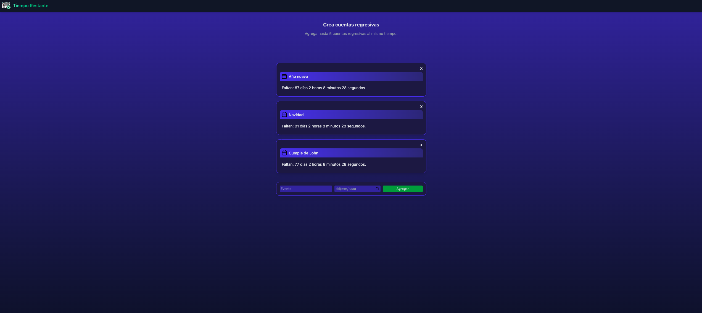

# ⏳ Tiempo Restante

Herramienta simple y minimalista para crear cuentas regresivas personalizadas desde el navegador. Agrega un evento con su fecha y mira en tiempo real cuánto falta (días, horas, minutos, segundos).

**Demo:** [https://tiemporestante.netlify.app/](https://tiemporestante.netlify.app/)

---

## 📸 Captura de pantalla



---

## ✨ Características

* ➕ **Agregar eventos** con título y fecha.
* 🕒 **Cuenta regresiva en vivo** que se actualiza cada segundo.
* 📱 **Diseño responsive** (funciona en desktop y mobile).
* 🗑 **Eliminar eventos** fácilmente.
* 🎨 **Interfaz limpia y minimalista**.

> Nota: Se pueden agregar hasta 5 eventos simultáneos, todos visibles en la interfaz principal.

---

## 🧪 Cómo usar

1. Abre la app: **[https://tiemporestante.netlify.app/](https://tiemporestante.netlify.app/)**
2. Haz clic en **Agregar**.
3. Escribe un título y selecciona la fecha.
4. El evento aparecerá en la lista y el contador se actualizará en vivo.

Sugerencias de uso:

* Ideal para contar hacia fechas importantes (exámenes, viajes, cumpleaños, etc.).
* Usa nombres cortos para mantener la interfaz limpia.

---

## 🚀 Desarrollo local

Si quieres correrlo en tu máquina:

```bash
# 1) Clona tu repo
git clone <URL_DE_TU_REPO>
cd <carpeta-del-proyecto>

# 2) Abre el index en tu navegador
# (opción A) Doble clic en index.html
# (opción B) Usa un servidor local:
# - con VS Code: extensión "Live Server"
# - con Node (opcional): npx serve .
```

---

## 📄 Licencia

Este proyecto está bajo la licencia MIT. Puedes adaptarlo libremente.

---

## 👨‍💻 Autor

Desarrollado por **Agostino Dev** — [tiemporestante.netlify.app](https://tiemporestante.netlify.app/)
